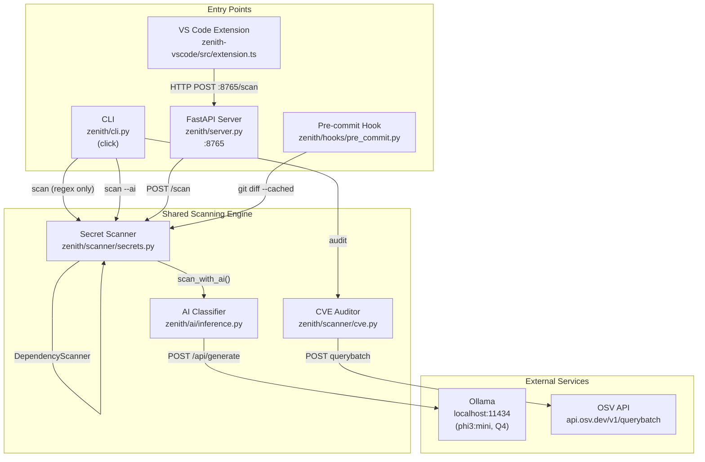

# PROJECT_ARCHITECTURE.md — Zenith Technical Reference

This document describes the architecture, dependencies, file layout, configuration files, known limitations, and verified metrics for the Zenith project as of 2026-07-28.

---

## 1. System Architecture Diagram



### Data flow summary

| Path | Flow |
|---|---|
| **CLI regex scan** | `cli.py` reads file, calls `secrets.scan_text()`, displays Rich table |
| **CLI AI scan** | `cli.py` reads file, calls `secrets.scan_with_ai()`, which calls `scan_text()` then routes each finding through `inference.ZenithClassifier.is_live_secret()` to Ollama |
| **CLI audit** | `cli.py` calls `cve.get_vulnerabilities()`, which parses manifests and posts to the OSV batch API |
| **VS Code extension** | `extension.ts` debounces keystrokes (600ms), sends document text via HTTP POST to `server.py:8765`, server calls `scan_with_ai()`, extension renders diagnostics and decorations |
| **Pre-commit hook** | `pre-commit` framework passes filtered file list as `sys.argv[1:]`, hook runs `git diff --cached --unified=0 -- <files>`, passes diff text to `secrets.scan_text()`, exits non-zero if findings exist |

---

## 2. Technology Stack

### Backend (Python)

| Dependency | Version Constraint | Purpose |
|---|---|---|
| Python | >=3.10 | Runtime |
| click | unpinned | CLI framework |
| rich | unpinned | Terminal formatting (tables, panels, spinners) |
| requests | unpinned | HTTP client for Ollama and OSV APIs |
| fastapi | unpinned | Background scan server |
| uvicorn | unpinned | ASGI server for FastAPI |
| setuptools | unpinned | Build backend |

Source: `pyproject.toml` lines 8-9

### AI / ML

| Dependency | Version Constraint | Purpose |
|---|---|---|
| torch | unpinned | Listed in pyproject.toml but unused in current code (Ollama replaces direct model loading) |
| transformers | unpinned | Listed in pyproject.toml but unused in current code |
| accelerate | unpinned | Listed in pyproject.toml but unused in current code |
| onnxruntime | unpinned | Listed in pyproject.toml; referenced in non-Mac path but that path is not implemented |
| Ollama (external) | Not version-pinned | Local LLM server, model `phi3:mini` (Q4 quantized) |

Source: `pyproject.toml` line 9, `zenith/ai/inference.py` lines 68-73

### VS Code Extension

| Dependency | Version Constraint | Role |
|---|---|---|
| VS Code Engine | ^1.90.0 | Minimum required VS Code version |
| axios | ^1.7.2 | HTTP client (runtime dependency) |
| typescript | ^5.4.5 | Compiler (devDependency) |
| esbuild | ^0.21.5 | Bundler (devDependency) |
| @types/vscode | ^1.90.0 | Type definitions (devDependency) |
| @types/node | 20.x | Type definitions (devDependency) |

Source: `zenith-vscode/package.json` lines 7-33

### Tooling

| Tool | Purpose |
|---|---|
| pre-commit | Git hook management framework |
| setuptools | Python package build backend |
| esbuild | VS Code extension bundling |

---

## 3. File Tree

Generated from the repository root, excluding `.git/`, `.venv/`, `node_modules/`, `__pycache__/`, `zenith.egg-info/`, and `dist/`.

```text
.
├── .gitignore
├── .pre-commit-config.yaml
├── .pre-commit-hooks.yaml              # Empty file (unused)
├── DEMO.md                             # Live presentation script
├── README.md                           # Root project README
├── demo.py                             # Demo: fake secret examples for scanning
├── diagnostic.py                       # Diagnostic: environment/hardware detection
├── nedemo.py                           # Demo: negative test cases (mock-only secrets)
├── pyproject.toml                      # Python package configuration
├── requirements.txt                    # Mock dependency file (for demo auditing)
├── tests/
│   ├── __init__.py
│   ├── test_cve.py                     # Unit tests for CVE manifest parsers
│   └── test_edge_cases.py             # Tests for dependency scanning, binary file handling, AI output parsing
├── zenith/
│   ├── __init__.py
│   ├── .pre-commit-config.yaml         # Duplicate config inside package (unused by pre-commit)
│   ├── .pre-commit-hooks.yaml          # Empty file inside package (unused)
│   ├── README.md                       # Package-level README (duplicate of root)
│   ├── pyproject.toml                  # Duplicate pyproject inside package (unused by build)
│   ├── ai/
│   │   ├── __init__.py
│   │   └── inference.py                # ZenithClassifier: Ollama-backed AI secret classifier
│   ├── cli.py                          # Click CLI: scan, audit, init-ai commands
│   ├── hooks/
│   │   ├── __init__.py
│   │   └── pre_commit.py              # Git pre-commit hook (respects sys.argv file filtering)
│   ├── mitigation/
│   │   └── fixer.py                   # Empty placeholder module
│   ├── scanner/
│   │   ├── __init__.py
│   │   ├── cve.py                     # CVE auditor: manifest parsers + OSV API client
│   │   └── secrets.py                 # Regex secret scanner + AI verification orchestrator
│   └── server.py                       # FastAPI server exposing POST /scan on :8765
└── zenith-vscode/
    ├── README.md                       # Extension documentation
    ├── package.json                    # Extension manifest and dependencies
    ├── package-lock.json
    ├── tsconfig.json                   # TypeScript compiler configuration
    └── src/
        └── extension.ts               # VS Code extension: debounced scanning + diagnostics
```

---

## 4. Configuration File Contents

### pyproject.toml

```toml
[build-system]
requires = ["setuptools"]
build-backend = "setuptools.build_meta"

[project]
name = "zenith"
version = "0.1.0"
requires-python = ">=3.10"
dependencies = ["click", "rich", "requests", "fastapi", "uvicorn", "torch", "transformers", "accelerate", "onnxruntime"]

[project.scripts]
zenith = "zenith.cli:cli"

[tool.setuptools.packages.find]
where = ["."]
```

### requirements.txt

```text
# A mock dependency file created for the Presentation Demo!
requests==2.20.0
boto3==1.26.0
slack-sdk==3.0.0
```

### zenith-vscode/package.json

```json
{
  "name": "zenith-vscode",
  "displayName": "Zenith AI Security Scanner",
  "description": "Real-time AI secret scanning in VS Code",
  "version": "0.1.0",
  "publisher": "Cy-nape",
  "engines": {
    "vscode": "^1.90.0"
  },
  "categories": [
    "Linters",
    "Security"
  ],
  "activationEvents": [
    "onStartupFinished"
  ],
  "main": "./dist/extension.js",
  "contributes": {},
  "scripts": {
    "vscode:prepublish": "npm run package",
    "compile": "tsc -p ./",
    "watch": "tsc -watch -p ./",
    "package": "esbuild ./src/extension.ts --bundle --outfile=dist/extension.js --external:vscode --format=cjs --platform=node",
    "build": "npm run package"
  },
  "devDependencies": {
    "@types/vscode": "^1.90.0",
    "@types/node": "20.x",
    "typescript": "^5.4.5",
    "esbuild": "^0.21.5"
  },
  "dependencies": {
    "axios": "^1.7.2"
  }
}
```

### .pre-commit-config.yaml

```yaml
repos:
  - repo: local
    hooks:
      - id: zenith-scan
        name: Zenith Security Guard
        entry: python -m zenith.hooks.pre_commit
        language: system
        stages: [pre-commit]
        types: [text]
        exclude: ^(demo\.py|nedemo\.py|diagnostic\.py|tests/.*|zenith-vscode/README\.md)$
```

### .gitignore

```gitignore
# Environments
.venv/
env/
venv/
ENV/

# Python cache & build
__pycache__/
*.py[cod]
*$py.class
*.egg-info/
.eggs/
build/
dist/

# Node
node_modules/
dist/

# Debug and Session Artifacts
*.vsix
*.log
run_investigation*.py
run_fix_tests.py
test_ollama.py
raw_test.py
hook_test_temp.py
```

---

## 5. Known Limitations

Each limitation below was verified by reading the current source code.

### 5.1 AI classifier accuracy depends entirely on Ollama model quality

The `ZenithClassifier` (`inference.py` lines 95-106) sends a structured prompt to Ollama asking for a JSON response with `is_live`, `confidence`, and `reason` fields. The prompt template uses `<|system|>` / `<|user|>` / `<|assistant|>` delimiters specific to the Phi-3 chat format. Accuracy is limited by:
- The model's ability to parse and understand code context within a 5-line window (`secrets.py` line 118: `window=5`).
- The fallback parser (`_parse_output_static`, `inference.py` lines 14-28): if the model returns non-JSON text, the fallback uses a naive heuristic — if the word "test" or "example" appears anywhere in the code snippet (case-insensitive), it marks the secret as not live. This can both false-positive and false-negative.

### 5.2 Non-Mac ONNX path is declared but not implemented

`inference.py` lines 72-74 set `self.model_path = "models/zenith_phi3_int4.onnx"` and list ONNX execution providers for non-Mac platforms. However, `_init_session()` (lines 76-93) only ever attempts to connect to Ollama at `localhost:11434` — it never loads an ONNX model. On non-Mac systems, if Ollama is not running, the classifier will fall back to flagging everything as live (the safe default). The ONNX loading code was never written.

### 5.3 VS Code extension does not cancel in-flight HTTP requests

`extension.ts` lines 102-113 implement debouncing: each new keystroke clears the previous `setTimeout` timer. However, once a `scanDocument()` call has been dispatched (the `axios.post` on line 49), there is no `AbortController` or cancellation mechanism. If the user types rapidly, multiple HTTP requests may be in flight simultaneously. The stale-response check at line 55 (`doc.version !== reqVersion`) prevents rendering outdated results, but it does not prevent redundant server-side work or network overhead.

### 5.4 CVE manifest parsers are hand-rolled and have edge-case gaps

Verified in `cve.py`:
- **Cargo.toml parser** (lines 62-79): Uses a line-by-line section-header approach. It enters "dependency mode" when it sees any `[...]` header containing "dependencies" (case-insensitive), meaning it also matches `[dev-dependencies]` and `[build-dependencies]`. It extracts the first quoted string after `=` as the version. It does not handle multi-line table syntax (`rand = { version = "0.8", features = [...] }` split across lines), workspace inheritance (`rand.workspace = true`), or path/git dependencies without a version string.
- **go.mod parser** (lines 81-90): Strips the literal string `"require "` from each line before regex matching. It does not distinguish between the `require (...)` block and `replace` or `exclude` directives, so replaced modules could be incorrectly included.
- **pom.xml parser** (lines 41-60): Uses `xml.etree.ElementTree` with both namespaced (`{*}`) and un-namespaced element lookups. It skips dependencies whose version contains `${` (Maven property references). It iterates all descendants, not just direct `<dependencies>` children, which means `<dependencyManagement>` entries are also included.
- **package.json parser** (lines 21-38): Strips all non-digit/non-dot characters from version strings. A version like `">=2.0.0 <3.0.0"` becomes `"2.0.03.0.0"`, which will not match any real version in the OSV database.
- **requirements.txt parser** (lines 6-19): Only matches `package==version` (exact pin). Any other specifier (`>=`, `~=`, `!=`) is silently ignored.

### 5.5 `scan_text()` line number calculation is based on character offset within the entire input

`secrets.py` line 100: `text[:m.start()].count("\n") + 1`. When used by the pre-commit hook, the input is a unified diff (not the raw file), so the reported line numbers are positions within the diff output, not the actual file line numbers.

### 5.6 The `mitigation/fixer.py` module is empty

The file exists but contains no code. The module is never imported by any other file.

### 5.7 `requirements.txt` is a demo artifact, not real project dependencies

The `requirements.txt` file contains intentionally outdated packages (`requests==2.20.0`, `boto3==1.26.0`, `slack-sdk==3.0.0`) for demonstrating the CVE audit feature. Actual project dependencies are defined in `pyproject.toml`.

### 5.8 `torch`, `transformers`, `accelerate`, and `onnxruntime` are declared but unused at runtime

These four packages are listed in `pyproject.toml` dependencies but are never imported anywhere in the current codebase. The AI inference path uses `requests` to call Ollama's HTTP API instead. They remain as dependencies from a previous architecture where the model was loaded directly via `transformers`.

### 5.9 Duplicate configuration files inside `zenith/` subdirectory

`zenith/.pre-commit-config.yaml`, `zenith/.pre-commit-hooks.yaml`, `zenith/README.md`, and `zenith/pyproject.toml` are duplicates or stubs that exist inside the Python package directory. They are not used by any tooling (pre-commit reads from the repo root, setuptools reads the root `pyproject.toml`).

### 5.10 LRU cache on `_cached_inference` uses prompt string as key

`inference.py` line 30: `@lru_cache(maxsize=2000)`. The cache key is the full prompt string. Since the prompt includes the code snippet, any change to the surrounding code context (even whitespace) generates a new cache entry. The cache is not persisted across process restarts and is per-process (not shared between the CLI and the FastAPI server).

### 5.11 Server error handling returns HTTP 200 on failure

`server.py` lines 31-35: If `scan_with_ai()` raises an exception, the server returns `status_code=200` with an empty findings array. The VS Code extension has no way to distinguish between "no secrets found" and "the scanner crashed".

---

## 6. Verified Real Metrics

All values below were measured during the testing session on 2026-07-28 on an Apple Silicon Mac.

| Metric | Value | How Measured |
|---|---|---|
| Pre-commit hook scan time (regex only, single file diff) | <1 second | Observed during `git commit` tests — hook completed in the synchronous shell within ~1s wall time |
| Ollama model used | `phi3:mini` (Q4 quantized) | Confirmed via `inference.py` line 69 and successful Ollama connectivity tests |
| Pre-commit hook exit code on real secret | 1 (blocked) | Verified with `hook_test_temp.py` containing `AKIA...` — exact output recorded |
| Pre-commit hook exit code on excluded file | 0 (passed) | Verified with `zenith-vscode/README.md` containing `sk_livefake...` — exact output recorded |
| Pre-commit file-scoping behavior | Correctly respects `sys.argv[1:]` from pre-commit framework | Verified via combined test: staging both excluded and non-excluded files in one commit |

### Not independently measured during this session

| Metric | Claimed Value | Source |
|---|---|---|
| Phi-3-mini model download size | ~3.8 GB (full precision); Q4 quantized via Ollama is smaller | README documentation; not downloaded during session |
| RAM usage during AI inference | 16 GB recommended | README documentation; not profiled during session |
| AI inference latency per finding | Sub-second (claimed) | Not independently timed; Ollama was running but individual per-finding latency was not isolated |
| ONNX Runtime performance on non-Mac | Unknown | ONNX code path is not implemented; no testing was performed |
